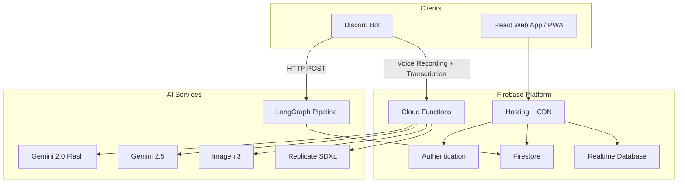

# Chaggerheart

## The Problem

People engage in role-playing with their communities for the same reason they engage in theater, improv, and creative writing: to inhabit someone else's skin for a few hours. A shy accountant becomes a silver-tongued bard. A stressed-out nurse becomes a guardian standing between her friends and a god. The table becomes a stage, the dice add stakes, and for a few hours the real world recedes. That release, that freedom to perform and create and surprise each other, is why millions of people play.

Then someone has to look up a modifier. A player stops mid-scene to check a reference document for what their ability does. The game master pauses the scene to calculate armor. The spell breaks. After the session, the game master spends hours writing notes, updating character sheets, and reconstructing what happened so the next session can pick up where this one left off. Most campaigns don't die from bad stories. They die from the logistics between them.

Daggerheart was designed to address the rules side of this. It strips mechanical overhead so players can stay in character and game masters can stay in the narrative. But the tooling never caught up. Characters still live in fillable PDFs. The game made space for immersion. The tools keep interrupting it.

## The Solution

Chaggerheart picks up where the game design left off. It's a web app built around a single principle: automation frees you to play.

Everything that pulls a player out of character, the app handles. Abilities resolve on tap. Dice rolls apply their mechanical effects automatically. Character sheets live on the phone in your hand at the table, not in a binder you have to flip through. For game masters (the player who runs the world, controls the story, and manages every non-player character at the table), the dashboard shows the whole party's state in real time, so running a scene never means breaking it to ask "wait, how much HP do you have?"

The biggest intervention is after the session ends. A Discord bot records session audio and runs it through a 5-agent AI pipeline that writes structured notes, recaps, and game-master-only plot summaries. The hours of post-session homework that quietly kill campaigns become an 8-second processing job. The game master stays in creative control. The app handles everything that isn't storytelling.

*Character sheet: abilities resolve on tap, dice rolls apply effects automatically, inventory and HP track in real time.*

The app is live at [chaggerheart.com](https://chaggerheart.com), built and shipped by a solo founder with no engineering team.

## Traction

All organic, zero marketing spend. Users found the app through Daggerheart community channels (Discord servers, Reddit, word of mouth).

| Metric | Value |
|--------|-------|
| Registered users | 82 |
| Activation rate (created 1+ character) | 61% |
| Characters created | 52 (across all 9 classes) |
| Campaigns launched | 11 |
| In-app feedback submissions | 29 |
| Peak monthly active users | 32 (December 2025) |

Character class distribution is roughly even across all nine classes, which suggests the builder handles the full breadth of the game system rather than funneling users toward a few well-supported options.

## Market Context

The initial assumption was that no digital tooling existed for Daggerheart. A competitive analysis in October 2025 revealed 15+ active competitors, from free community tools (Daggerstack, HeartSmith, FreshCutGrass) to the official Demiplane Nexus platform ($34.99 + subscription). The market was more crowded than expected.

Two findings shaped the product strategy:

1. **Zero competitors had AI features.** Every tool in the space offered static character sheets and reference lookups. None automated session notes, offered AI-assisted content creation, or used machine learning for balance analysis. AI became the primary differentiation axis.

2. **Session management was an open gap.** Seven of eight analyzed competitors had no session note system at all. Demiplane announced a "GM Journal" feature in mid-2025 that hadn't shipped four months later. Chaggerheart's Chronicle pipeline (Discord audio recording through LangGraph-powered note generation) addressed the one pain point that no competitor was solving.

The competitive landscape validated the product direction and accelerated AI development. Rather than competing on character sheet features where free tools already had traction, the roadmap shifted toward session intelligence and user-created content, areas where the composable engine architecture and AI pipeline created a defensible advantage.

## How Users Shaped the Product

With 29 in-app feedback submissions and direct observation from live play sessions, user input drove several design decisions:

- **The Homebrew Workshop UX.** Early prototypes used a single form with all fields visible. User testing showed players freezing when confronted with 20+ configuration options at once. The 7-step wizard design came directly from watching users struggle with the form approach.
- **The Brewmaster's role.** Players who understood game mechanics wanted the structured wizard. Players who didn't wanted to describe abilities in natural language. Rather than choosing one audience, the Brewmaster bridges them: conversational AI translates intent into structured configs, then hands off to the wizard for final control.
- **Character class coverage.** Tracking that characters were distributed roughly evenly across all nine classes confirmed the builder handled the full breadth of the game system, not just the well-documented options. This was a signal to keep investing in edge-case mechanics rather than polishing the popular paths.
- **Session note adoption.** GMs reported that post-session homework was the primary reason campaigns died. The Chronicle pipeline's 8-second processing time wasn't an engineering target for its own sake; it was calibrated against the user behavior of checking notes immediately after a session ends.

## Key Product Decisions

### Composable mechanic engine over hardcoded features

The first version of Chaggerheart had a dedicated React component for every ability: one switch-case per mechanic, each with its own state logic and edge cases. That approach stopped scaling around 50 abilities and made user-created content impossible.

The [Composable Mechanic Engine](engine/) replaced bespoke code with JSON configs. Each ability is defined as a combination of conditions, costs, and effects. The engine validates the config, executes it through a 6-phase pipeline, and returns a result. The calling component applies it. This reduced 230+ abilities to config entries and opened the same surface for homebrew content, where players define their own mechanics using the same format.

The migration used dual-path routing: the engine checks its registry first, then falls through to legacy code for anything not yet migrated. Zero regressions, no big-bang rewrite.

### Hybrid Node.js + Python AI architecture

Session analysis needs two things that do not live well in the same runtime: a Discord bot that records audio and stays connected to a WebSocket, and a multi-agent LLM pipeline that processes transcripts into structured notes.

The [hybrid architecture](ai-pipeline/) keeps Node.js for Discord event handling, voice recording, and transcription (where its ecosystem is strongest), and Python for the LangGraph agent pipeline (where the AI/ML ecosystem is strongest). The boundary is a single HTTP call. The Python service runs on a scale-to-zero container, so it only costs money when processing a session. A 3-hour session processes in roughly 8 seconds.

### Campaign frames as a pattern registry

Daggerheart ships six official campaign frames, each with unique mechanics. Implementing each frame as custom code would have meant six parallel feature tracks.

Instead, the system uses a [registry of 14 reusable pattern components](architecture/campaign-frames.md) (ResourceHarvest, TokenPool, FlavorCooking, FactionRelations, ColossalAdversary, and nine others). Frame configs declare which patterns to use and where they appear. Adding a new frame that fits existing patterns requires zero new React components: just a JSON entry for static data and a config entry for behavior. An audit script validates nine structural rules on every commit.

*GM dashboard: real-time view of every character's HP, stress, armor, and active effects during a session.*

*Beast Feast: a campaign-frame-specific cooking minigame built entirely from reusable pattern components.*

### Automated compliance tooling

Chaggerheart operates under the Darrington Press Community Gaming License (DPCGL). Violations (wrong trademark usage, missing attribution, unapproved artwork) could mean losing the right to publish. For a solo developer who is also the only reviewer, manual compliance checks are unreliable.

The solution was to [encode the rules as executable checks](quality/compliance-tooling.md) that run on every commit via pre-commit hooks. Six deterministic rules cover button component usage, feature detection patterns, z-index conventions, dialog APIs, domain card config completeness, and barrel export coverage. Nine additional rules cover campaign frame integrity. The same rules run as Jest tests in CI. Legal constraint and code quality standards turned out to enforce the same things.

## Technical Architecture

The React frontend communicates with Firebase for auth, persistence, and real-time sync. AI features route through Cloud Functions to keep credentials server-side. The Discord bot connects to the Python LangGraph service for session analysis and writes results back to Firestore. Full architecture details are in the [system overview](architecture/).

## AI Integration

The [Chronicle pipeline](ai-pipeline/) is a 5-agent LangGraph workflow that transforms raw session transcripts into structured notes. An Extraction agent parses the transcript into typed game events. An Analysis agent identifies story beats, character moments, and GM-sensitive information. A Formatting agent writes the prose. A Summary agent generates a "Previously On..." recap. A GM Filter agent splits the output into player-safe notes and GM-only notes that include plot-sensitive details.

Beyond session analysis, four other AI features serve distinct product needs: a [Brewmaster NPC chat](homebrew-workshop.md) that helps users design homebrew mechanics through natural language conversation, homebrew balance checking that compares user-created content against the official game corpus, AI recipe generation for the Beast Feast cooking minigame, and character portrait generation via Imagen 3. Each feature uses a different model and interaction pattern, chosen based on the task's complexity, latency requirements, and cost profile. The full [multi-model strategy](ai-pipeline/multi-model-strategy.md) documents the reasoning behind each choice.

The [Homebrew Workshop](homebrew-workshop.md) is the largest AI-integrated feature: a content creation platform where players build custom game mechanics through a 7-step wizard, with AI assistance for translation (natural language to structured config) and balance feedback. Homebrew content runs on the same engine as official content, with no distinction in rendering or behavior.

## Delivery and Process

500+ story points delivered across 13+ sprints at a sustained velocity of ~22 SP/week, as a solo founder handling product, design, engineering, and QA. 630+ commits spanning 6 months of continuous development. Velocity stabilized after sprint 3 as codebase patterns compounded. The largest item in any sprint was capped at 8 SP; anything bigger was split. Every story had explicit acceptance criteria, and "done" meant live in production with passing audits.

GitHub Issues served as backlog, sprint board, and documentation. No Jira, no Linear. Pre-commit hooks and 350+ automated tests replaced the second pair of eyes that a solo project does not have. Full sprint breakdown and estimation methodology are in the [delivery metrics](delivery/).

## Quality and Compliance

Two audit scripts (6 rules for the main codebase, 9 for campaign frames) run as pre-commit hooks and block violations before they reach the repository. The same rules are encoded as Jest tests so CI catches anything that bypasses the hook. Rules cover component usage patterns, feature detection conventions, UI standards, config completeness, and barrel export coverage. This eliminated an entire category of review work and made compliance verifiable rather than aspirational. Details in [compliance tooling](quality/compliance-tooling.md).

## Stack

| Layer | Technology |
|-------|-----------|
| Frontend | React 18, Tailwind CSS |
| Backend | Firebase (Firestore, Auth, Cloud Functions, Hosting) |
| Real-time | Firebase Realtime Database |
| AI / ML | LangGraph (Python), Gemini 2.0 Flash, Imagen 3 |
| Bot | Node.js Discord Bot |
| AI Service | Python, FastAPI, LangGraph |
| Testing | Jest, React Testing Library |
| Compliance | Custom audit scripts, Husky pre-commit hooks |

## Links

| Resource | URL |
|----------|-----|
| Live product | [chaggerheart.com](https://chaggerheart.com) |
| Company | Chag Innovations LLC |
