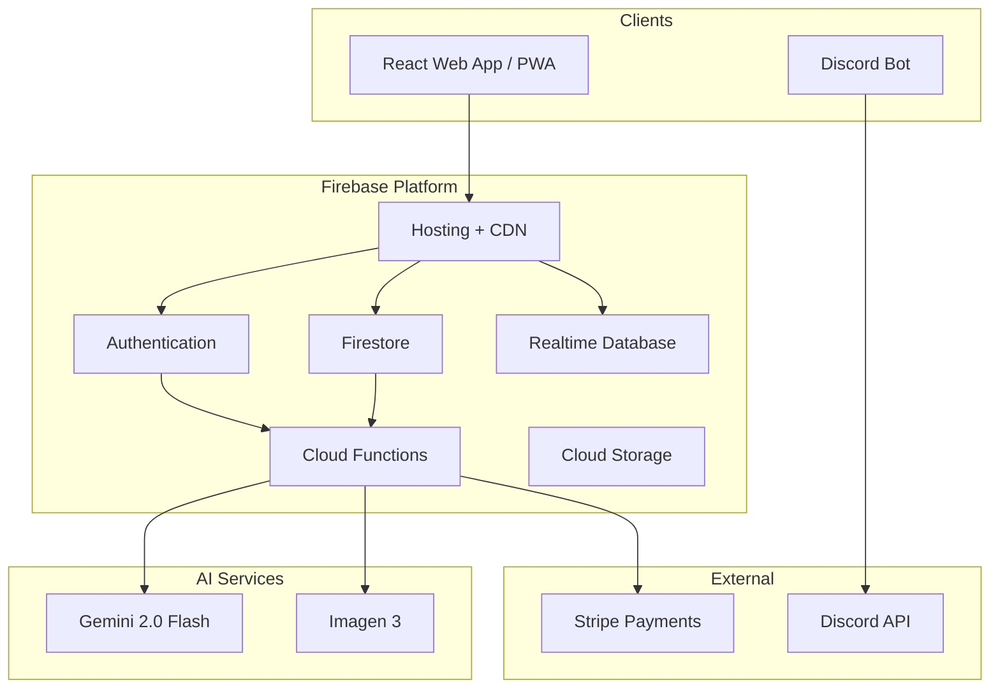
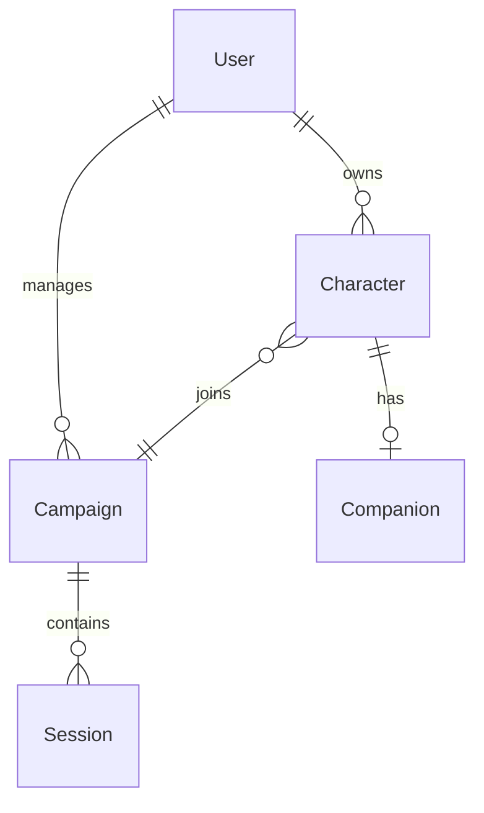

# Chaggerheart: System Architecture Overview

Chaggerheart is an AI-powered character management app for the Daggerheart tabletop RPG. Players use it to build and track characters; game masters use it to run campaigns in real time. This document describes the high-level technical architecture.

---

## Technology Stack

| Layer | Technology | Rationale |
|-------|-----------|-----------|
| Frontend | React 18, Tailwind CSS | Component reuse across character sheet, campaign dashboard, and homebrew tools |
| Backend | Firebase (BaaS) | Faster development velocity vs. custom backend; built-in auth, realtime DB, and hosting |
| Database | Cloud Firestore + Realtime Database | Firestore for persistent character/campaign data; Realtime DB for live session collaboration |
| AI | Google Vertex AI (Gemini) | Recipe generation, session note processing, homebrew balance analysis |
| File Storage | Cloud Storage | Character portrait uploads |
| Functions | Cloud Functions for Firebase | Serverless handlers for AI calls, payment webhooks, data triggers |
| Bot | Node.js Discord Bot | Dice rolling and character lookup in Discord servers |

---

## High-Level System Diagram



---

## Application Layers

```
┌────────────────────────────────────────────────────────┐
│                   Presentation Layer                    │
│  Character Sheet · Campaign Dashboard · Homebrew Workshop│
└──────────────────────────┬─────────────────────────────┘
                           │
┌──────────────────────────▼─────────────────────────────┐
│                   Application Layer                     │
│  Character Mgmt · Campaign Coordination · AI Processing │
└──────────────────────────┬─────────────────────────────┘
                           │
┌──────────────────────────▼─────────────────────────────┐
│                     Service Layer                       │
│  Auth Service · Data Service · Token Service · AI Service│
└──────────────────────────┬─────────────────────────────┘
                           │
┌──────────────────────────▼─────────────────────────────┐
│                      Data Layer                         │
│  Firestore · Realtime DB · Cloud Storage               │
└────────────────────────────────────────────────────────┘
```

---

## Frontend Architecture

The React app uses the **Context API** for global state, organized in three providers:

- **AuthContext** — user identity and subscription tier
- **DataContext** — game data (SRD content loaded at startup)
- **CampaignContext** — active campaign and session state

Components follow a container/presenter split: smart containers handle data fetching and subscription, presenter components handle rendering. Complex UI logic lives in custom hooks (HP management, equipment, character sync).

The app ships as a **Progressive Web App (PWA)** so players can install it on mobile without going through an app store.

---

## Data Model Overview

**Core entities and their relationships:**



**Characters** store all mechanical data: six stats, vitals (HP, stress, hope, armor), equipment, domain card loadout, and a flexible token map for special abilities (flight, invisibility, spell charges, etc.).

**Campaigns** store participant lists, GM settings, shared notes, and active collaborative activities (group actions, shared cooking sessions).

**Real-time collaboration** uses the Realtime Database for low-latency sync during active sessions: presence indicators, live dice rolls, and multi-player group actions.

**Homebrew content** is stored per-user as a subcollection, with draft and ready states, and is loaded into the character builder when active.

---

## Data Flow: Character Update

A typical character state change (e.g., spending Hope to activate an ability) follows this path:

1. User clicks a button in the character sheet
2. The mechanic engine validates conditions and pays costs against a character copy
3. If all costs clear, the engine commits effects and calls `updateCharacter()`
4. `updateCharacter()` writes to Firestore
5. Other clients subscribed to this character's document receive the update via Firestore's real-time listener

This keeps the optimistic UI fast while Firestore handles persistence and cross-client sync.

---

## AI Integration

AI features route through Cloud Functions to keep API credentials server-side. Current integrations:

| Feature | Model | Input | Output |
|---------|-------|-------|--------|
| Homebrew Balance Check | Gemini 2.0 Flash | Composed mechanic JSON | Pass/warn/fail report vs. SRD corpus |
| Brewmaster Chat | Gemini 2.0 Flash | User prompt + campaign context | Composed mechanic JSON config |
| AI Recipe Generation (Beast Feast) | Gemini 2.0 Flash | Ingredients + dietary tags | Three recipe options with flavor text |
| Scene Image Generation | Imagen 3 | Scene description + character descriptions | 16:9 scene image |

AI usage is tracked per user per month and capped by subscription tier.

---

## Security Model

**Authentication** uses Firebase Auth (email/password and Google OAuth). Every request carries a Firebase ID token verified server-side.

**Authorization** is enforced at the database level via Firestore Security Rules:

- Characters are readable only by their owner, campaign GM, or fellow campaign members
- Campaigns are writable only by the GM
- Users can only read and write their own profile document
- Homebrew content is private by default

**No sensitive credentials or collection paths** are exposed to the client. AI calls and payment webhooks run in Cloud Functions with service account credentials injected via the environment at deploy time.

---

## Infrastructure

The app deploys to two Firebase projects: one for production and one for development/staging. Deployments are triggered via CLI and take under two minutes. There are no containers or servers to manage.

The Discord bot runs as a separate Node.js process hosted on a PaaS provider, connecting to the same Firestore project for character lookups.

---

*Last updated: March 2026*
